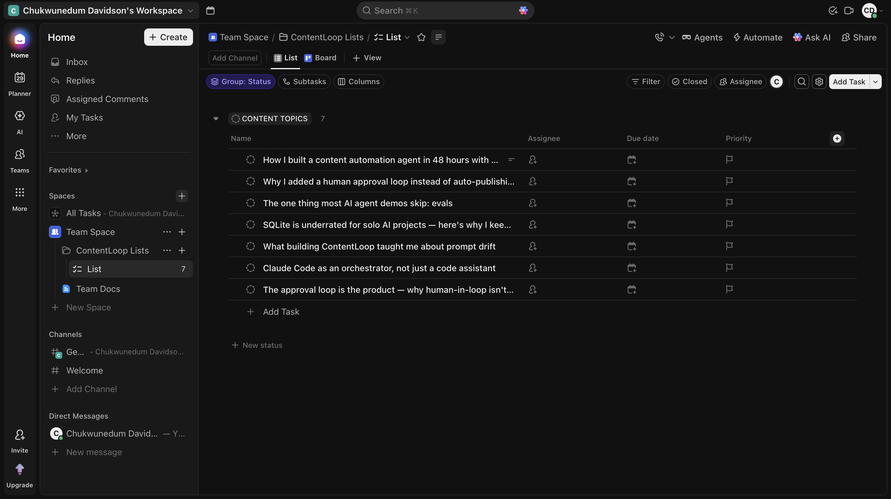
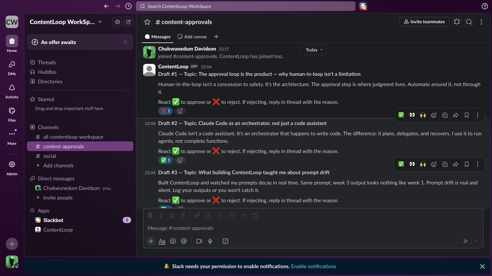

# ContentLoop

A social media automation agent built with Claude Code. Reads content topics from ClickUp,
pulls post metrics from X, generates drafts via Claude, and routes them through a Slack
approval loop. Evals run nightly to detect prompt drift.

Built to demonstrate: "Build and maintain AI social media agents that monitor performance,
generate content drafts, and execute scheduled publishing workflows."

## Demo

**ClickUp — content topics queue**


**Slack — approval loop**


## Architecture

```
ClickUp (topics) ──┐
                   ├──► Claude (drafter) ──► Slack (approval)
X API (metrics) ───┘                              │
                                                  ▼
                                            SQLite (drafts)
                                                  │
                                                  ▼
                                        Evals (nightly) ──► Slack alert
```

Orchestrated by Claude Code via headless `claude -p` calls and custom slash commands.
GitHub Actions handles the cron schedule.

## Setup

### 1. Clone and install

```bash
git clone https://github.com/nedu-m/contentloop
cd contentloop
pip install -r requirements.txt
```

### 2. Configure credentials

```bash
cp .env.example .env
# fill in all values in .env
```

You need:
- **Anthropic API key** — [console.anthropic.com](https://console.anthropic.com)
- **ClickUp API token** — ClickUp Settings → Apps → API Token
- **ClickUp List ID** — from the URL of your Content Topics list
- **Slack app** — create at api.slack.com/apps (see below)
- **X API v2 access** — [developer.twitter.com](https://developer.twitter.com)

#### Slack app setup
1. Create a new app → From scratch
2. Enable Socket Mode → generate an App-Level Token (`SLACK_APP_TOKEN`)
3. Add Bot Token Scopes: `chat:write`, `reactions:read`, `channels:history`
4. Subscribe to events: `reaction_added`, `reaction_removed`
5. Install to workspace → copy Bot Token (`SLACK_BOT_TOKEN`)
6. Invite the bot to your approvals channel → copy Channel ID (`SLACK_CHANNEL_ID`)

### 3. Initialize the database

```bash
python db/init_db.py
```

### 4. Spike each integration

```bash
python scripts/test_clickup.py
python scripts/test_x.py
python scripts/test_claude.py
python scripts/test_slack.py   # interactive — react to the posted message
```

### 5. Add topics to ClickUp

Create tasks in your Content Topics list. Each task name is a topic.
Add a description if you want more context passed to the drafter.

### 6. Run the pipeline

```bash
# Option A: via Claude Code slash command (recommended)
claude -p "/run-content-loop"

# Option B: manually, step by step
python agents/pull_metrics.py
python agents/sync_topics.py
python agents/drafter.py
python agents/poster.py
```

### 7. Start the listener (in a separate terminal)

```bash
python agents/listener.py
```

Go to Slack. React ✅ to approve a draft or ❌ to reject it (reply in thread with reason).

### 8. Run evals

```bash
claude -p "/eval-this-week"
# or directly:
python agents/evals.py
```

## GitHub Actions (cron)

Add all secrets to your repo → Settings → Secrets and variables → Actions.

- `content-loop.yml` — runs every Monday at 9am UTC
- `evals.yml` — runs every night at 2am UTC

Trigger manually from the Actions tab to test before the schedule fires.

## What's next

- **LinkedIn publishing** — add `pull_metrics_linkedin.py`, platform column in DB, LinkedIn API integration
- **Auto-publish gate** — unlock auto-publish when acceptance rate exceeds 90% over 4 weeks
- **Draft regeneration** — on rejection, auto-generate a revised draft using the rejection reason as feedback
- **Multi-topic batching** — one Slack message per run summary, not one per draft

## Design decisions

See [WHY.md](WHY.md) for the reasoning behind human-in-loop, Claude Code as orchestrator,
SQLite, Slack as UI, and GitHub Actions.
